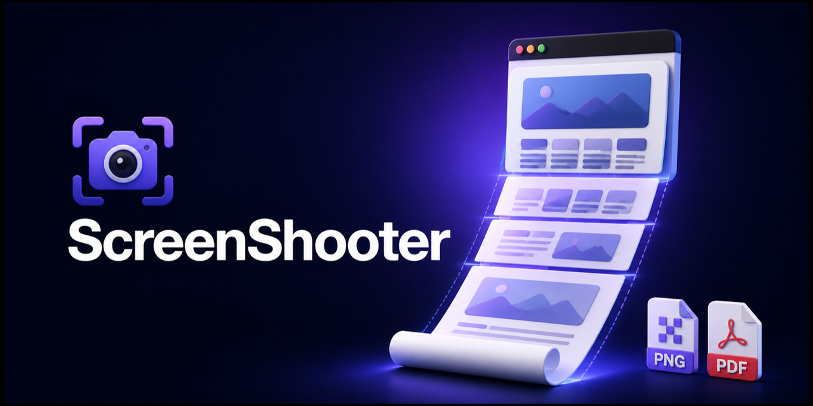

# ScreenShooter

[English](README.md) | [Русский](README.ru.md)

[Сайт](https://javedius.github.io/ScreenShooter/) · [Политика конфиденциальности](https://javedius.github.io/ScreenShooter/privacy.ru.html)

ScreenShooter — расширение для браузера, которое сохраняет видимую область, всю прокручиваемую страницу или выбранный элемент в PNG либо PDF.

## Возможности

- Захват видимой области текущей вкладки.
- Захват всей прокручиваемой страницы.
- Выбор и захват отдельного элемента страницы.
- Экспорт снимков в PNG или PDF.
- Поддержка обычных страниц и приложений с внутренними контейнерами прокрутки.
- Скрытие полосы прокрутки и повторяющихся закреплённых элементов.
- Удаление распространённых cookie-баннеров, чат-виджетов и рекламных оверлеев.
- Автоматическое переключение между русским и английским по языку браузера.

## Установка

1. Скачайте или клонируйте репозиторий.
2. Откройте `chrome://extensions` или `edge://extensions`.
3. Включите **Режим разработчика**.
4. Нажмите **Загрузить распакованное расширение**.
5. Выберите папку проекта.

Снимки сохраняются в `Загрузки/ScreenShooter`.

## Структура проекта

- `background/` содержит сценарии захвата, работу с вкладкой и сохранение результата.
- `page/` содержит функции, выполняемые внутри снимаемой страницы.
- `offscreen/` отвечает за canvas, склейку, обрезку, PNG и PDF.
- `popup/` содержит интерфейс и настройки расширения.
- `shared/` содержит локализацию, общие параметры, имена файлов и сообщения об ошибках.

## Ограничения MVP

- Служебные страницы браузера, например `chrome://`, и магазины расширений нельзя захватывать.
- Некоторые нестандартные закреплённые элементы могут повторяться на длинном снимке.
- Очень высокие страницы могут превысить максимальный размер canvas браузера.
